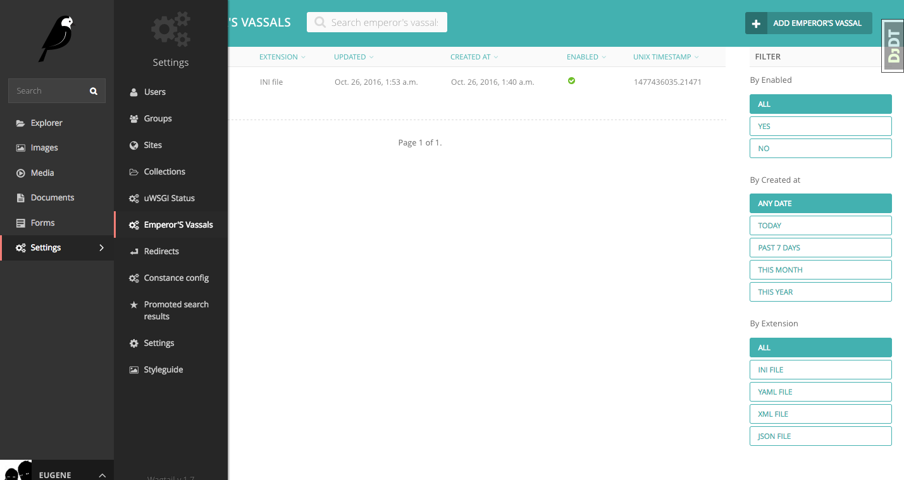

Emperor
=======

you can use `django_uwsgi.emperor` module if you want to store vassals configs in `PostgreSQL`_ database.

Simply add `'django_uwsgi.emperor',` into `INSTALLED_APPS`

.. code-block:: py

   INSTALLED_APPS += ['django_uwsgi.emperor',]

Populate vassals via django admin interface and start uwsgi with command like:

.. code-block:: sh

   uwsgi --plugin emperor_pg --emperor "pg://host=127.0.0.1 user=foobar dbname=emperor;SELECT name,config,ts FROM vassals WHERE enabled = True"

Each time vassal added, removed, updated, enabled or disabled - uwsgi will start/stop it or reload.

.. _PostgreSQL: http://uwsgi-docs.readthedocs.org/en/latest/ImperialMonitors.html#pg-scan-a-postgresql-table-for-configuration